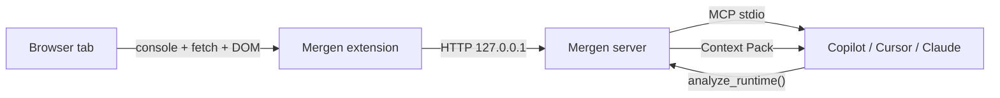

<div align="center">

# Mergen

### Local-first runtime debugging for AI assistants.

**The 30 seconds between a bug appearing in your browser and the fix landing in your editor — and nothing in between leaves your laptop.**

[](./server)
[](./LICENSE)
[](https://modelcontextprotocol.io)
[](#privacy)
[](./docs/HONESTY.md)

[**Setup →**](./SETUP.md) · [**Architecture →**](./ARCHITECTURE.md) · [**Pricing →**](#pricing)

</div>

---

## What it is

Mergen is the runtime-observability layer your AI assistant has been missing.

A browser extension streams `console.*`, `fetch`/`xhr`, and DOM state to a local Node server on `127.0.0.1`. The server correlates them into a **causal chain**, ranks **hypotheses by their actual track record** — not just model confidence — and exposes the result as **MCP tools** that Copilot Chat, Cursor, Claude Code, Windsurf, and ChatGPT Desktop can call directly.

Mergen is **continuous**, not crash-triggered. Every page refresh, hot-reload, network burst, and idle background tick produces a fresh diagnosis — so when your code finally throws, your AI already has the stack trace, the failing request, the response body, the DOM snapshot, **and a baseline of what the page looked like 30 seconds ago when it was still fine**.

Mergen is also **calibrated**. Every hypothesis we surface carries a stable id; one click in the panel ("✓ Yes / ◐ Sort of / ✕ No") teaches the engine which detectors are worth trusting. Detectors below 50% empirical accuracy are demoted; below 20% they're suppressed entirely. The status bar only interrupts you when the firing detector has earned the right (≥60% accuracy, ≥5 verdicts). You don't get "we generate hypotheses" — you get **"we track which hypotheses are actually correct."** See [`docs/HONESTY.md`](./docs/HONESTY.md).



---

## Why it exists

> **Sentry built dashboards for humans. Mergen built tools for your AI.**

Every other observability product is *during* or *after* deploy: Sentry, LogRocket, Datadog RUM, Highlight. They ship beautiful dashboards to your engineering manager. None of them speak to your AI assistant in its native language.

Every other "browser MCP" is a thin pipe — `getConsoleLogs()`, `clickElement()`. Useful for *agents driving a browser*, useless for the *human debugging their own dev session*.

Mergen sits in the gap nobody else does:

|                          | Production observability | Browser MCPs        | **Mergen**                      |
| ------------------------ | ------------------------ | ------------------- | ------------------------------- |
| When it's used           | After deploy             | Agent automation    | **The dev inner loop**          |
| Audience                 | On-call eng              | Headless agents     | **You, mid-typo**               |
| Surface for AI           | Bolted-on chat panel     | Raw log dump        | **Ranked Context Pack via MCP** |
| Causal chain             | ❌                       | ❌                  | ✅ error ↔ network ↔ DOM in 30s window |
| Hypothesis ranking       | ❌                       | ❌                  | ✅ HIGH/MEDIUM/LOW + fix hint   |
| Source-mapping           | partial                  | ❌                  | ✅                              |
| Where data lives         | Vendor cloud             | Vendor cloud / OSS  | **127.0.0.1 — never leaves**    |
| PII redaction            | configurable, server-side| ❌                  | ✅ at the edge, before storage  |

---

## What's in the box

- **Browser extension** (Chrome / Edge MV3) — streams console, network, DOM
- **Local server** (Node 18+) — ring buffer, causal correlation, MCP host
- **VS Code extension** — sidebar with Context Pack card, hypothesis history, status bar
- **MCP tools** for any host that speaks MCP:
  - `get_status` · `get_recent_logs` · `get_network_activity` · `get_dom_context` · `clear_buffer` *(free)*
  - `analyze_runtime` — the magic: full causal chain, source-mapped, with ranked hypotheses *(paid)*
- **CLI** — `mergen status`, `mergen doctor`, `mergen guard` *(pre-commit)*, `mergen start/stop/clear`
- **HTTP API** — `/diagnose`, `/last-pack`, `/history`, `/timeline` *(text-based session replay)*, `/checkpoint`, `/feedback` + `/calibration` + `/calibration/export` *(audit-friendly CSV)* for non-MCP integrations
- **Continuous-watch loop** — background watcher rebuilds the Context Pack on every pageload, HMR, network burst, and 15 s idle tick. North-Star metric: *analyses per developer per day*, exposed on `/usage`.

---

## Privacy

**Local-first runtime debugging.** This is not a marketing phrase, it's the architecture.

| What                          | Where                                    |
| ----------------------------- | ---------------------------------------- |
| Browser → server              | `127.0.0.1`, never the internet          |
| Buffer                        | In-memory only, capped, cleared on quit  |
| License key                   | `~/.mergen/license.json`, validated lazily |
| PII (JWTs, emails, tokens)    | Redacted at ingest by `redact.ts` *before* storage |
| Network bodies                | Clamped to 8 KB at the edge              |
| Telemetry                     | **Off by default**, opt-in, URL-gated, throttled to 1×/24h, anonymous installId only |

The server binds to `127.0.0.1` — not `0.0.0.0`. Other devices on your Wi-Fi can't reach it. Your AI host talks MCP over **stdio**, which is a pipe, not a socket. Nothing about your code, logs, or browsing leaves the machine unless you explicitly POST to `/telemetry { enabled: true }` *and* set `MERGEN_TELEMETRY_URL` *and* the 24-hour throttle window has elapsed.

For enterprises: this is the only runtime-debug tool you can run inside an air-gapped network without filing a security review.

---

## Pricing

| Plan          | Price        | `analyze_runtime` per month | Buffer | Team sync |
| ------------- | ------------ | --------------------------- | ------ | --------- |
| **Free**      | $0           | **10 / month** *(feel the magic)* | 50 events | — |
| Solo Standard | $19 / mo     | 500 (then $0.05 each)       | 200    | — |
| Solo Pro      | $39 / mo     | **Unlimited**               | 200    | — |
| Team          | $49 / seat   | Unlimited                   | 200    | ✅        |
| Pay-as-you-go | $0 + $0.05 / call | metered                | 200    | — |

The free tier ships **ten real diagnoses per month**, not infinite raw logs. Other tools brag about throughput. We brag about *answers*.

---

## What we deliberately *don't* do

Restraint is a feature.

- ❌ **No tab automation / `clickElement`.** That's Playwright + Browser MCP territory; OSS will always undercut paid here.
- ❌ **No video session replay.** LogRocket owns that ground; we do scrubbable *text* timelines instead.
- ❌ **No production SDK.** Sentry et al. are great at prod. We are great at the inner loop. Different problems.
- ❌ **No mandatory cloud account.** You can use 100% of the free tier without an email address.
- ❌ **No telemetry-by-default.** It is structurally impossible for us to look at your code.

---

## Install in 60 seconds

```bash
git clone https://github.com/omertt27/Mergen.git
cd mergen/server && npm install && npm run build && npm start
```

Then add to `.vscode/mcp.json`:

```jsonc
{
  "servers": {
    "mergen": {
      "type": "stdio",
      "command": "node",
      "args": ["${workspaceFolder}/../server/dist/index.js"]
    }
  }
}
```

Load `mergen/extension` as an unpacked Chrome extension. Done — your AI assistant now sees what your browser sees.

Full instructions: [SETUP.md](./SETUP.md).

---

## Distribution

Mergen lives where your AI assistant lives:

- 🟢 **VS Code Marketplace** — `mergen.mergen` *(stock VS Code, Insiders, Codespaces)*
- 🟢 **Open VSX** — `mergen.mergen` *(Cursor, Windsurf, VSCodium, Gitpod, code-server)*
- 🟢 **Cursor MCP Directory**
- 🟢 **Anthropic MCP Catalog**
- 🟢 **`awesome-mcp-servers`** *(category: debugging)*
- 🟢 **Chrome Web Store** *(coming)*
- 🟡 **JetBrains Marketplace** *(v1.1 — power users can wire stdio-MCP today)*

If your editor speaks MCP, Mergen already speaks to it. We treat Cursor / Copilot / Claude as **distribution channels, not competitors** — and we publish to **both** registries so neither MS nor non-MS users are second-class.

See [`docs/PUBLISHING.md`](./docs/PUBLISHING.md) for the editor-to-registry map and one-command publish flow.

---

## License

MIT. The bridge is free forever. The Hypothesis Engine + Team Sync pay the bills.

---

<div align="center">

**Mergen — the only runtime observability tool built for AI assistants.**
Local-first. Causally correlated. 30 seconds from bug to fix.

</div>
