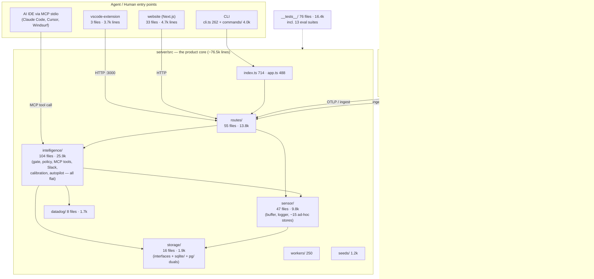

# Mergen Codebase Map & Improvement Plan

*Generated 2026-07-01 from a full scan of the repo (excluding `node_modules`, `dist`, `.next`, and stale `.claude/worktrees`).*

## 1. High-level architecture map



### Interception path (the product's critical path)

```
MCP tool call → tool-guard.ts → bypass.ts / gate-decision.ts / hitl-hold.ts
             → enterprise-policy-engine.ts (hard policies)
             → override-corpus.ts (enforcement corpus)
             → platt-scaling.ts (confidence gate)
             → PASS / BLOCK (agent-blunder-store, hash-chained) / HOLD (Slack HITL)
```

## 2. Size & shape by module

| Module | Files | Lines | Notes |
|---|---|---|---|
| `server/src/intelligence` | 104 | 25,852 | **Flat directory**, six+ distinct domains mixed together; ~13 hand-written `.d.ts` files interleaved |
| `server/src/__tests__` | 76 | 16,366 | Healthy volume; includes `evals/` gate-enforcement suites |
| `server/src/routes` | 55 | 13,844 | Flat; `dashboard.ts` (1,421) and `sensor.ts` (1,040) are god-files |
| `server/src/sensor` | 47 | 9,760 | `buffer.ts` (831) + ~15 ad-hoc `*-store.ts` persistence files **outside** the storage abstraction |
| `website` | 33 | 4,739 | Next.js marketing/account site |
| `server/src/commands` | 6 | 3,967 | Recently split from `cli.ts` ✅; `setup.ts` still 1,129 |
| `vscode-extension` | 3 | 3,697 | `panel.ts` (1,641) is the single largest source file in the repo |
| `server/src/storage` | 16 | 1,890 | Clean interface + sqlite/pg dual backends — but only 5 store types covered |
| `server/src/datadog` | 8 | 1,665 | |
| `packages/*` | 10 | 1,055 | types / node / browser / python instrumentation |
| `sdk/` | 5 | 833 | Overlaps in purpose with `packages/mergen-node` & `mergen-browser` |
| `aggregation-server` | 1 | 375 | Single untested JS file, own deployment |

**Top god-files:** `vscode-extension/src/panel.ts` 1,641 · `routes/dashboard.ts` 1,421 · `intelligence/tools-runbook.ts` 1,274 · `commands/setup.ts` 1,129 · `intelligence/slack.ts` 1,126 · `intelligence/tools-analysis.ts` 1,106 · `routes/sensor.ts` 1,040 · `routes/impact-report.ts` 957 · `intelligence/incident-autopilot.ts` 882.

**Fan-in hotspots (imports from other modules):** `sensor/logger` ×75, `sensor/buffer` ×49, `sensor/paths` ×30, `storage/store-registry` ×22, `sensor/agent-blunder-store` ×12, `intelligence/enterprise-policy-engine` ×11.

**Hygiene signals:** only 2 TODO/FIXME markers (very clean); 3 stale agent worktrees under `.claude/worktrees/`; 15 modified files + 1 new migration + new tests currently uncommitted on `main`.

## 3. Improvement plan

### P0 — Housekeeping (hours)

1. **Land the in-flight work.** 15 modified files, `migrations/004_cryptographic_chaining.sql`, and two new test suites sit uncommitted on `main`. Commit or branch them before anything else — every observation below is against a moving target until then.
2. **Prune stale worktrees.** `git worktree remove` the three `.claude/worktrees/agent-*` trees (one tracks an old `copilot/fix-build-test-node-22-x` branch). They triple-count in every grep/wc and confuse tooling.

### P1 — Bring sensor's ad-hoc stores under the storage abstraction (highest-leverage)

`storage/` has the right pattern: `interfaces.ts` → `store-factory.ts` → `sqlite/` + `pg/` duals. But only 5 store types (events, incidents, approvals, override-corpus, shadow-log) use it. Meanwhile `sensor/` carries ~15 hand-rolled persistence files (`agent-blunder-store`, `habituation-store`, `adr-store`, `layer2/3/4-store`, `pr-shadow-store`, `commit-context-store`, `agent-memory-store`, …) that bypass it entirely.

**Consequence:** in team/cloud (Postgres) mode, the blunder log — the hash-chained audit trail you sell as tamper-evident — and habituation metrics still live in local SQLite/JSON. That's a real product gap for Layer 2 (CI/team) deployments, not just aesthetics. Migrate stores in order of enterprise value: `agent-blunder-store` → `habituation-store` → `pr-shadow-store` → the rest.

### P2 — Restructure `intelligence/` into subdomains

104 flat files mixing six domains. Proposed split (moves only, no logic changes; follow the pattern of the recent `tool-guard` and `cli.ts` splits):

```
intelligence/
├── gate/          tool-guard, gate-decision, hitl-hold, bypass, execution-gate,
│                  execution-mode, planning-gate, gate-analytics, action-risk
├── policy/        enterprise-policy-engine, override-corpus, corpus-to-policy,
│                  policy-proposals, policy-suggester, policy-sync, git-adr-sync
├── mcp-tools/     the 17 tools-*.ts files + tool-manifest, mcp-prompts, mcp-resources
├── slack/         slack, slack-digest, slack-override-loop, slack-routing, notifications
├── calibration/   platt-scaling, calibration-*, confidence-report, threshold-optimizer
├── autopilot/     incident-autopilot, causal-graph, cascade-detector, detectors,
│                  incident-replay, rollback, postmortem-*
└── types/         consolidate the ~13 stray hand-written .d.ts files
```

Then group `routes/` (55 flat files) the same way: `gate/`, `incidents/`, `integrations/` (pagerduty, sentry, github, slack, otel), `admin/` (tenants, rbac, api-keys, license, billing).

### P3 — Decompose the god-files

Continue the proven split pattern, in impact order:

| File | Lines | Split by |
|---|---|---|
| `vscode-extension/src/panel.ts` | 1,641 | webview HTML/messaging/state |
| `routes/dashboard.ts` | 1,421 | one router per dashboard section |
| `intelligence/tools-runbook.ts` | 1,274 | tool registration vs. runbook engine |
| `commands/setup.ts` | 1,129 | per-integration setup steps |
| `intelligence/slack.ts` | 1,126 | Web API client vs. message formatting vs. interactive handlers |
| `routes/sensor.ts` | 1,040 | ingest vs. query endpoints |

### P4 — Loosen the `sensor/logger` + `buffer` coupling

75 and 49 fan-in imports respectively make these the de-facto god-modules; any change ripples everywhere. Extract a narrow interface (`log()`, `append()`, `query()`) into `packages/mergen-types` or a small `server/src/core/` and have consumers import that. Do this *after* P2 so the moves don't churn twice.

### P5 — Close the test-coverage gaps

16.4k test lines all target `server/src`. Zero tests exist for:
- `vscode-extension` (3.7k lines) — at minimum, message-protocol unit tests for `panel.ts`
- `commands/` (4.0k lines) — setup/team flows are onboarding-critical and untested
- `aggregation-server` (375 lines) and `sdk/` plugins

The `evals/` suite (gate enforcement, adversarial, security-hardening) is a genuine strength — extend it as the policy engine grows rather than duplicating unit coverage.

### P6 — Consolidate instrumentation surfaces

`sdk/` (node.js entry, browser inject snippets, vite/webpack plugins) and `packages/mergen-node` / `mergen-browser` serve the same purpose through two mechanisms. Pick `packages/*` as canonical, make `sdk/` thin re-exports (or fold it in), and decide whether `aggregation-server`'s single file belongs inside `server/` as a route/worker.

### Sequencing

P0 now → P1 (product gap, do before more Layer-2/team features) → P2+P3 as background refactors between feature work → P4 after P2 settles → P5 continuously, gating new modules on tests → P6 opportunistically before the next npm publish.
